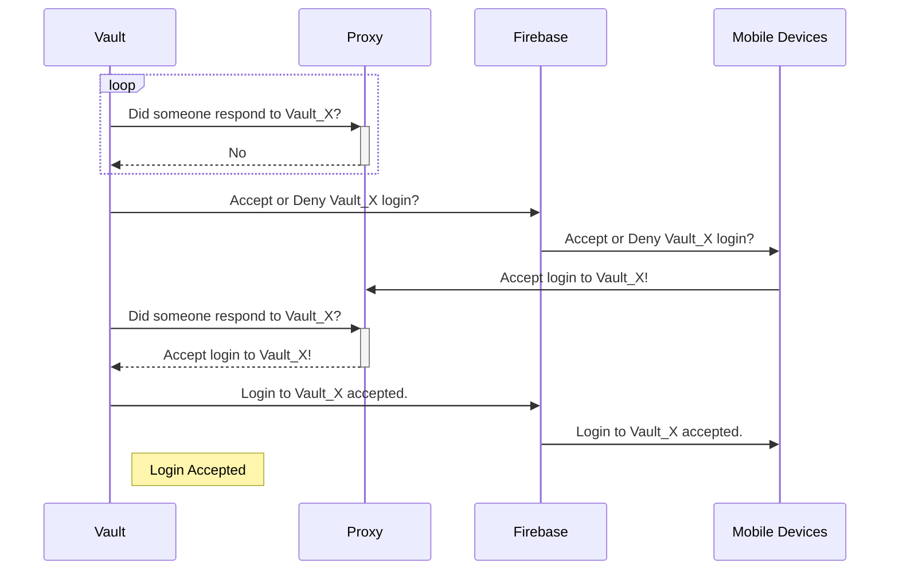

# Vepiot

This is a authentication plugin for [Hashicorp Vault](https://github.com/hashicorp/vault).

The idea of this plugin is to add a manual human step into the authentication process. This works by registering the app with the vault and every time the vault tries to authenticate via this service. The service makes a push notification via firebase. The user can accept the authentication or deny it.

## TODO:
* CI/CD
* More secure device registration
* Testcases
* ...